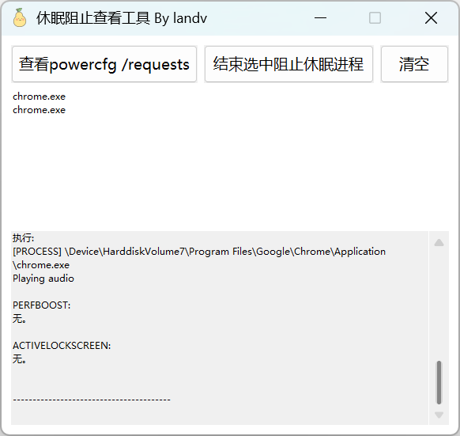

# 休眠阻止查看工具 (SleepBlockTool)

一个 Windows 桌面小工具（Win32 原生 GUI），用于查看哪些进程正在阻止系统进入休眠/睡眠，并支持一键结束这些进程。

## 功能特性

- 自动请求管理员权限（UAC 提权）。
- 执行 `powercfg /requests` 查看当前系统休眠/睡眠的阻止请求。
- 自动解析 `[PROCESS]` 段，在列表中显示阻止休眠的进程名。
- 选中进程后一键结束（通过 `wmic`），无需手动打开命令行。
- 操作日志带时间戳追加显示在界面中，可滚动查看历史，支持一键清空。
- 命令在后台线程执行、完全隐藏控制台窗口，无黑窗闪烁。
- 界面控件随窗口大小自适应排列，可拖动边框调整大小。

## 界面说明

| 区域 | 说明 |
| ---- | ---- |
| 查看 powercfg /requests | 执行查询，刷新进程列表与日志 |
| 结束选中阻止休眠进程 | 结束列表中所选进程 |
| 清空 | 清空日志显示区 |
| 进程列表 | 显示阻止休眠的进程名（exe） |
| 日志区 | 带时间戳的命令输出记录 |

## 运行效果



## 环境要求

- Windows 10 / 11（简体中文环境显示效果最佳）
- Visual Studio 2022 / 2026 或更高版本，包含 **使用 C++ 的桌面开发** 工作负载
- Windows SDK

## 编译方法

在 **Visual Studio Developer PowerShell** 中切换到项目目录并运行：

```powershell
cd 项目目录
.\build.ps1              # 默认 Release x64
```

### build.ps1 参数

| 参数 | 说明 |
| ---- | ---- |
| `-Arch x86` | 编译 32 位版本（默认 x64） |
| `-Arch arm64` | 编译 ARM64 版本 |
| `-Configuration Debug` | 生成调试版本（保留 .pdb 便于调试） |
| `-KeepIntermediates` | 构建后保留 .obj / .res 等中间文件 |
| `-Clean` | 删除所有构建产物（含 exe）后退出 |

> 脚本会自动清理上次构建残留的中间文件，并在构建成功后清理 `.obj` / `.res`（Release 下连同 `.pdb`）。
> 若在普通 PowerShell 中运行，脚本会自动定位 Visual Studio 并通过 `Enter-VsDevShell` 进入开发环境。

### 手动编译（等价命令）

```powershell
rc.exe /nologo /fo SleepBlockTool.res SleepBlockTool.rc
cl.exe /nologo /EHsc /O2 /DNDEBUG /DUNICODE /D_UNICODE ^
      /Fo:SleepBlockTool.obj /Fe:SleepBlockTool.exe SleepBlockTool.cpp SleepBlockTool.res ^
      /link /subsystem:windows kernel32.lib user32.lib gdi32.lib shell32.lib advapi32.lib comctl32.lib
```

## 使用说明

1. 启动程序，如非管理员会自动触发 UAC 提权。
2. 点击【查看 powercfg /requests】，稍候进程列表中出现阻止休眠的进程。
3. 在列表中选中目标进程，点击【结束选中阻止休眠进程】。
4. 结束结果与完整输出会显示在下方日志区。

## 项目文件

| 文件 | 说明 |
| ---- | ---- |
| `SleepBlockTool.cpp` | 主程序源码（Win32 窗口程序） |
| `SleepBlockTool.rc` | 资源脚本（图标 + 内嵌清单） |
| `icon.ico` | 程序图标 |
| `app.manifest` | 应用清单（管理员权限、DPI、通用控件） |
| `build.ps1` | PowerShell 编译脚本（自动清理中间文件） |
| `RE.txt` | 其它说明 |

## 实现说明

- **无黑窗执行**：使用 `CreateProcess` + `CREATE_NO_WINDOW`，并通过匿名管道重定向 stdout/stderr 捕获输出，替代 `_popen`，执行命令时不会闪现控制台窗口。
- **日志显示**：输出框以追加方式显示，自动添加时间戳，统一 `\n` → `\r\n` 换行并滚动到底部。
- **后台线程**：命令在独立线程执行，避免阻塞界面；完成后通过 `PostMessage` 回传主线程刷新。
- **双缓冲绘制**：`WM_PAINT` 中先绘制到内存位图再一次性 `BitBlt`，避免界面闪烁。
- **管理员权限**：`app.manifest` 声明 `requireAdministrator`，且程序内也带运行时提权逻辑（双重保障）。
